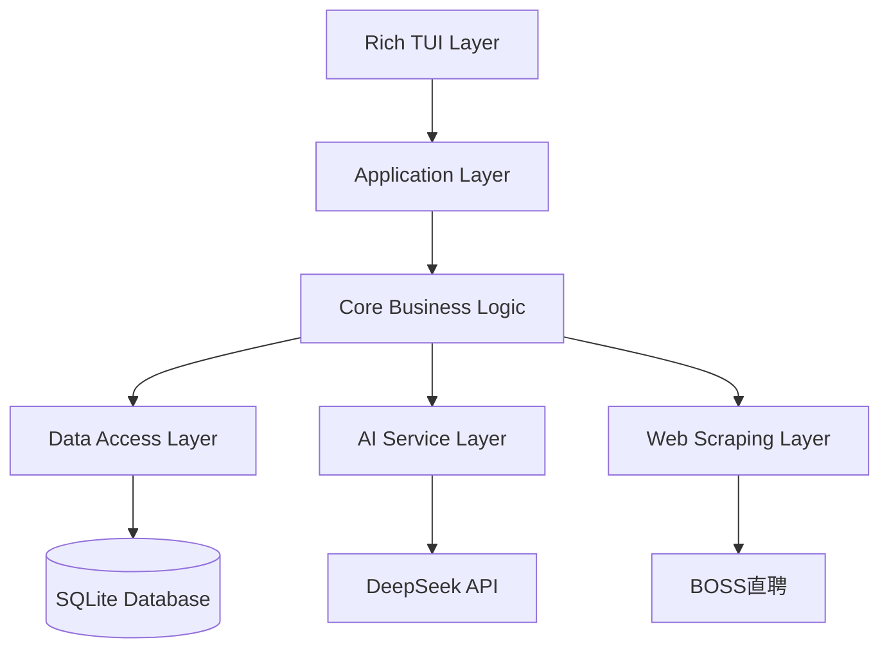
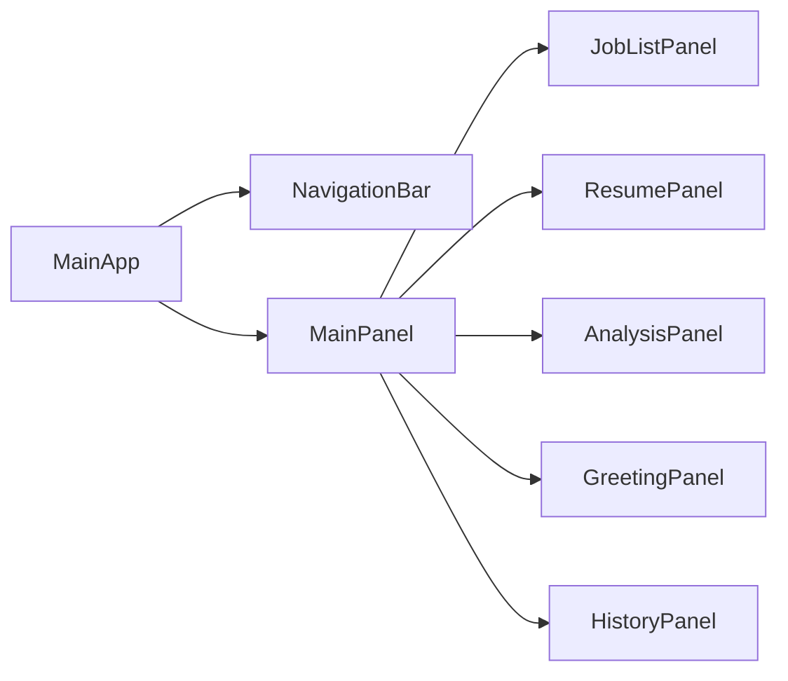

# Resume Assistant 设计文档

## 概述

Resume Assistant 是一个基于 Rich 框架的终端用户界面应用程序，旨在帮助求职者通过 AI 分析优化简历以匹配特定职位。系统采用模块化架构，集成 DeepSeek AI 模型，支持 BOSS 直聘职位信息爬取、简历解析、智能匹配分析、优化建议生成以及个性化打招呼语创建。

## 架构

### 整体架构



### 架构层次说明

1. **Rich TUI Layer**: 用户界面层，基于 Rich 框架实现终端图形界面
2. **Application Layer**: 应用控制层，协调各个组件和用户交互
3. **Core Business Logic**: 核心业务逻辑，包含简历分析、匹配算法等
4. **Data Access Layer**: 数据访问层，管理数据库操作和文件处理
5. **AI Service Layer**: AI 服务层，封装 DeepSeek API 调用
6. **Web Scraping Layer**: 网页抓取层，处理职位信息获取

### 技术栈选择

- **TUI 框架**: Rich - 提供丰富的终端UI组件和布局管理
- **数据库**: SQLite - 轻量级、无需配置的嵌入式数据库
- **PDF 解析**: PyMuPDF (fitz) - 高性能PDF文本提取
- **Markdown 解析**: python-markdown - 标准Markdown处理
- **网页爬虫**: requests + BeautifulSoup - 轻量级爬虫方案
- **AI 集成**: httpx - 现代异步HTTP客户端
- **配置管理**: pydantic-settings - 类型安全的配置管理
- **日志系统**: loguru - 现代化日志处理

## 组件和接口

### 1. TUI 组件架构



#### 1.1 主要 TUI 组件

**MainApp**
```python
class MainApp:
    """主应用程序类"""
    def __init__(self):
        self.console = Console()
        self.layout = self._create_layout()
        self.current_panel = "jobs"
        
    def _create_layout(self) -> Layout:
        """创建主布局"""
        pass
        
    def switch_panel(self, panel_name: str):
        """切换面板"""
        pass
```

**NavigationBar**
```python
class NavigationBar(Static):
    """导航栏组件"""
    BINDINGS = [
        ("1", "switch_jobs", "职位列表"),
        ("2", "switch_resume", "简历管理"),
        ("3", "switch_analysis", "分析结果"),
        ("4", "switch_greeting", "打招呼语"),
        ("5", "switch_history", "历史记录"),
    ]
```

**JobListPanel**
```python
class JobListPanel(Widget):
    """职位列表面板"""
    def __init__(self):
        super().__init__()
        self.table = DataTable()
        self.search_input = Input(placeholder="搜索职位...")
        
    def add_job(self, job: JobInfo):
        """添加职位到列表"""
        pass
        
    def filter_jobs(self, query: str):
        """筛选职位"""
        pass
```

### 2. 核心业务组件

#### 2.1 Job Scraper 组件

```python
class JobScraper:
    """职位信息爬虫"""
    
    def __init__(self, session: requests.Session):
        self.session = session
        self.headers = {
            'User-Agent': 'Mozilla/5.0 (Windows NT 10.0; Win64; x64) AppleWebKit/537.36'
        }
    
    async def scrape_job(self, url: str) -> JobInfo:
        """爬取单个职位信息"""
        pass
        
    def _parse_job_content(self, html: str) -> JobInfo:
        """解析职位HTML内容"""
        pass
```

#### 2.2 Resume Parser 组件

```python
class ResumeParser:
    """简历解析器"""
    
    def parse_pdf(self, file_path: Path) -> ResumeContent:
        """解析PDF简历"""
        pass
        
    def parse_markdown(self, file_path: Path) -> ResumeContent:
        """解析Markdown简历"""
        pass
        
    def _extract_sections(self, text: str) -> Dict[str, str]:
        """提取简历各部分内容"""
        pass
```

#### 2.3 AI Analyzer 组件

```python
class AIAnalyzer:
    """AI分析器"""
    
    def __init__(self, api_key: str, base_url: str):
        self.client = httpx.AsyncClient()
        self.api_key = api_key
        self.base_url = base_url
    
    async def analyze_match(self, job: JobInfo, resume: ResumeContent) -> MatchAnalysis:
        """分析简历与职位匹配度"""
        pass
        
    async def generate_optimization(self, analysis: MatchAnalysis) -> List[OptimizationSuggestion]:
        """生成优化建议"""
        pass
        
    async def generate_greeting(self, job: JobInfo, resume: ResumeContent) -> List[GreetingMessage]:
        """生成打招呼语"""
        pass
```

### 3. 数据访问组件

#### 3.1 Database Manager

```python
class DatabaseManager:
    """数据库管理器"""
    
    def __init__(self, db_path: Path):
        self.db_path = db_path
        self.init_database()
    
    def init_database(self):
        """初始化数据库表结构"""
        pass
        
    async def save_job(self, job: JobInfo) -> int:
        """保存职位信息"""
        pass
        
    async def save_resume(self, resume: ResumeContent) -> int:
        """保存简历信息"""
        pass
        
    async def save_analysis(self, analysis: MatchAnalysis) -> int:
        """保存分析结果"""
        pass
        
    async def save_greeting(self, greeting: GreetingMessage) -> int:
        """保存打招呼语"""
        pass
```

## 数据模型

### 1. 核心数据模型

```python
@dataclass
class JobInfo:
    """职位信息模型"""
    id: Optional[int] = None
    url: str = ""
    title: str = ""
    company: str = ""
    description: str = ""
    requirements: str = ""
    skills: List[str] = field(default_factory=list)
    created_at: datetime = field(default_factory=datetime.now)

@dataclass
class ResumeContent:
    """简历内容模型"""
    id: Optional[int] = None
    name: str = ""
    file_path: str = ""
    content: str = ""
    personal_info: Dict[str, str] = field(default_factory=dict)
    education: List[Dict[str, str]] = field(default_factory=list)
    experience: List[Dict[str, str]] = field(default_factory=list)
    projects: List[Dict[str, str]] = field(default_factory=list)
    skills: List[str] = field(default_factory=list)
    created_at: datetime = field(default_factory=datetime.now)

@dataclass
class MatchAnalysis:
    """匹配分析结果模型"""
    id: Optional[int] = None
    job_id: int = 0
    resume_id: int = 0
    overall_score: float = 0.0
    skill_match_score: float = 0.0
    experience_score: float = 0.0
    keyword_coverage: float = 0.0
    missing_skills: List[str] = field(default_factory=list)
    strengths: List[str] = field(default_factory=list)
    created_at: datetime = field(default_factory=datetime.now)

@dataclass
class OptimizationSuggestion:
    """优化建议模型"""
    section: str = ""
    original_text: str = ""
    suggested_text: str = ""
    reason: str = ""
    priority: int = 0

@dataclass
class GreetingMessage:
    """打招呼语模型"""
    id: Optional[int] = None
    job_id: int = 0
    resume_id: int = 0
    content: str = ""
    version: int = 1
    is_custom: bool = False
    created_at: datetime = field(default_factory=datetime.now)
```

### 2. 数据库表结构

```sql
-- 职位信息表
CREATE TABLE jobs (
    id INTEGER PRIMARY KEY AUTOINCREMENT,
    url TEXT UNIQUE NOT NULL,
    title TEXT NOT NULL,
    company TEXT NOT NULL,
    description TEXT,
    requirements TEXT,
    skills TEXT, -- JSON格式存储
    created_at TIMESTAMP DEFAULT CURRENT_TIMESTAMP,
    updated_at TIMESTAMP DEFAULT CURRENT_TIMESTAMP
);

-- 简历表
CREATE TABLE resumes (
    id INTEGER PRIMARY KEY AUTOINCREMENT,
    name TEXT NOT NULL,
    file_path TEXT,
    content TEXT NOT NULL,
    personal_info TEXT, -- JSON格式
    education TEXT, -- JSON格式
    experience TEXT, -- JSON格式
    projects TEXT, -- JSON格式
    skills TEXT, -- JSON格式
    is_default BOOLEAN DEFAULT FALSE,
    created_at TIMESTAMP DEFAULT CURRENT_TIMESTAMP,
    updated_at TIMESTAMP DEFAULT CURRENT_TIMESTAMP
);

-- 分析结果表
CREATE TABLE analyses (
    id INTEGER PRIMARY KEY AUTOINCREMENT,
    job_id INTEGER NOT NULL,
    resume_id INTEGER NOT NULL,
    overall_score REAL,
    skill_match_score REAL,
    experience_score REAL,
    keyword_coverage REAL,
    missing_skills TEXT, -- JSON格式
    strengths TEXT, -- JSON格式
    suggestions TEXT, -- JSON格式存储优化建议
    created_at TIMESTAMP DEFAULT CURRENT_TIMESTAMP,
    FOREIGN KEY (job_id) REFERENCES jobs (id),
    FOREIGN KEY (resume_id) REFERENCES resumes (id)
);

-- 打招呼语表
CREATE TABLE greetings (
    id INTEGER PRIMARY KEY AUTOINCREMENT,
    job_id INTEGER NOT NULL,
    resume_id INTEGER NOT NULL,
    content TEXT NOT NULL,
    version INTEGER DEFAULT 1,
    is_custom BOOLEAN DEFAULT FALSE,
    created_at TIMESTAMP DEFAULT CURRENT_TIMESTAMP,
    FOREIGN KEY (job_id) REFERENCES jobs (id),
    FOREIGN KEY (resume_id) REFERENCES resumes (id)
);

-- 应用配置表
CREATE TABLE app_settings (
    key TEXT PRIMARY KEY,
    value TEXT NOT NULL,
    updated_at TIMESTAMP DEFAULT CURRENT_TIMESTAMP
);
```

## 错误处理

### 1. 错误分类和处理策略

```python
class ResumeAssistantError(Exception):
    """基础异常类"""
    pass

class NetworkError(ResumeAssistantError):
    """网络相关错误"""
    pass

class ParseError(ResumeAssistantError):
    """解析相关错误"""
    pass

class AIServiceError(ResumeAssistantError):
    """AI服务相关错误"""
    pass

class DatabaseError(ResumeAssistantError):
    """数据库相关错误"""
    pass
```

### 2. 错误处理机制

```python
class ErrorHandler:
    """统一错误处理器"""
    
    def __init__(self, console: Console):
        self.console = console
        self.logger = logger
    
    def handle_error(self, error: Exception, context: str = ""):
        """统一错误处理"""
        self.logger.error(f"Error in {context}: {str(error)}")
        
        if isinstance(error, NetworkError):
            self._show_network_error(error)
        elif isinstance(error, ParseError):
            self._show_parse_error(error)
        elif isinstance(error, AIServiceError):
            self._show_ai_error(error)
        else:
            self._show_general_error(error)
    
    def _show_network_error(self, error: NetworkError):
        """显示网络错误"""
        self.console.print(Panel(
            f"[red]网络连接失败[/red]\n{str(error)}\n\n请检查网络连接或稍后重试",
            title="网络错误"
        ))
```

### 3. 重试机制

```python
from tenacity import retry, stop_after_attempt, wait_exponential

class RetryableService:
    """支持重试的服务基类"""
    
    @retry(
        stop=stop_after_attempt(3),
        wait=wait_exponential(multiplier=1, min=4, max=10)
    )
    async def call_api(self, *args, **kwargs):
        """可重试的API调用"""
        pass
```

## 测试策略

### 1. 测试层次

```python
# 单元测试
class TestResumeParser(unittest.TestCase):
    def test_parse_pdf(self):
        """测试PDF解析功能"""
        pass
    
    def test_parse_markdown(self):
        """测试Markdown解析功能"""
        pass

# 集成测试
class TestAIIntegration(unittest.TestCase):
    def test_analysis_workflow(self):
        """测试完整分析流程"""
        pass

# UI测试
class TestTUIComponents(unittest.TestCase):
    def test_job_list_panel(self):
        """测试职位列表面板"""
        pass
```

### 2. Mock 策略

```python
# Mock AI服务
class MockAIAnalyzer(AIAnalyzer):
    async def analyze_match(self, job: JobInfo, resume: ResumeContent) -> MatchAnalysis:
        return MatchAnalysis(
            overall_score=0.85,
            skill_match_score=0.9,
            experience_score=0.8,
            keyword_coverage=0.75
        )

# Mock 网络服务
class MockJobScraper(JobScraper):
    async def scrape_job(self, url: str) -> JobInfo:
        return JobInfo(
            url=url,
            title="测试职位",
            company="测试公司",
            description="测试描述"
        )
```

### 3. 测试数据管理

```python
class TestDataManager:
    """测试数据管理器"""
    
    @staticmethod
    def create_sample_job() -> JobInfo:
        """创建示例职位数据"""
        return JobInfo(
            title="Python开发工程师",
            company="科技公司",
            description="负责后端开发工作",
            requirements="3年以上Python开发经验",
            skills=["Python", "Django", "MySQL"]
        )
    
    @staticmethod
    def create_sample_resume() -> ResumeContent:
        """创建示例简历数据"""
        return ResumeContent(
            name="张三简历",
            content="个人简历内容...",
            skills=["Python", "Java", "React"]
        )
```

## 性能优化

### 1. 异步处理

```python
class AsyncTaskManager:
    """异步任务管理器"""
    
    def __init__(self):
        self.task_queue = asyncio.Queue()
        self.workers = []
    
    async def start_workers(self, num_workers: int = 3):
        """启动工作协程"""
        for i in range(num_workers):
            worker = asyncio.create_task(self._worker(f"worker-{i}"))
            self.workers.append(worker)
    
    async def _worker(self, name: str):
        """工作协程"""
        while True:
            task = await self.task_queue.get()
            try:
                await task()
            except Exception as e:
                logger.error(f"Task failed in {name}: {e}")
            finally:
                self.task_queue.task_done()
```

### 2. 缓存策略

```python
from functools import lru_cache
import aiofiles

class CacheManager:
    """缓存管理器"""
    
    def __init__(self, cache_dir: Path):
        self.cache_dir = cache_dir
        self.cache_dir.mkdir(exist_ok=True)
    
    @lru_cache(maxsize=100)
    def get_analysis_cache(self, job_hash: str, resume_hash: str) -> Optional[MatchAnalysis]:
        """获取分析结果缓存"""
        pass
    
    async def save_analysis_cache(self, job_hash: str, resume_hash: str, analysis: MatchAnalysis):
        """保存分析结果到缓存"""
        pass
```

### 3. 数据库优化

```sql
-- 创建索引优化查询性能
CREATE INDEX idx_jobs_company ON jobs(company);
CREATE INDEX idx_jobs_created_at ON jobs(created_at);
CREATE INDEX idx_analyses_job_resume ON analyses(job_id, resume_id);
CREATE INDEX idx_greetings_job_id ON greetings(job_id);

-- 创建视图简化复杂查询
CREATE VIEW job_analysis_summary AS
SELECT 
    j.title,
    j.company,
    a.overall_score,
    a.created_at as analysis_date
FROM jobs j
JOIN analyses a ON j.id = a.job_id
ORDER BY a.created_at DESC;
```

## 安全考虑

### 1. API 密钥管理

```python
from cryptography.fernet import Fernet
import os

class SecureConfig:
    """安全配置管理"""
    
    def __init__(self):
        self.encryption_key = self._get_or_create_key()
        self.cipher = Fernet(self.encryption_key)
    
    def _get_or_create_key(self) -> bytes:
        """获取或创建加密密钥"""
        key_file = Path.home() / ".resume_assistant" / "key"
        if key_file.exists():
            return key_file.read_bytes()
        else:
            key = Fernet.generate_key()
            key_file.parent.mkdir(exist_ok=True)
            key_file.write_bytes(key)
            return key
    
    def encrypt_api_key(self, api_key: str) -> str:
        """加密API密钥"""
        return self.cipher.encrypt(api_key.encode()).decode()
    
    def decrypt_api_key(self, encrypted_key: str) -> str:
        """解密API密钥"""
        return self.cipher.decrypt(encrypted_key.encode()).decode()
```

### 2. 数据加密

```python
class SecureStorage:
    """安全存储管理"""
    
    def __init__(self, encryption_key: bytes):
        self.cipher = Fernet(encryption_key)
    
    def encrypt_resume_content(self, content: str) -> str:
        """加密简历内容"""
        return self.cipher.encrypt(content.encode()).decode()
    
    def decrypt_resume_content(self, encrypted_content: str) -> str:
        """解密简历内容"""
        return self.cipher.decrypt(encrypted_content.encode()).decode()
```

### 3. 输入验证

```python
from pydantic import BaseModel, validator
import re

class JobUrlValidator(BaseModel):
    """职位URL验证器"""
    url: str
    
    @validator('url')
    def validate_boss_url(cls, v):
        """验证BOSS直聘URL格式"""
        pattern = r'https?://www\.zhipin\.com/job_detail/\w+\.html'
        if not re.match(pattern, v):
            raise ValueError('Invalid BOSS直聘 URL format')
        return v
```

## 部署和配置

### 1. 项目结构

```
resume_assistant/
├── src/
│   ├── resume_assistant/
│   │   ├── __init__.py
│   │   ├── main.py              # 应用入口
│   │   ├── config/
│   │   │   ├── __init__.py
│   │   │   └── settings.py      # 配置管理
│   │   ├── ui/
│   │   │   ├── __init__.py
│   │   │   ├── app.py           # 主应用
│   │   │   ├── panels/          # UI面板
│   │   │   └── components/      # UI组件
│   │   ├── core/
│   │   │   ├── __init__.py
│   │   │   ├── scraper.py       # 爬虫
│   │   │   ├── parser.py        # 解析器
│   │   │   ├── analyzer.py      # AI分析器
│   │   │   └── generator.py     # 内容生成器
│   │   ├── data/
│   │   │   ├── __init__.py
│   │   │   ├── database.py      # 数据库管理
│   │   │   ├── models.py        # 数据模型
│   │   │   └── migrations/      # 数据库迁移
│   │   └── utils/
│   │       ├── __init__.py
│   │       ├── errors.py        # 错误定义
│   │       ├── logging.py       # 日志配置
│   │       └── security.py      # 安全工具
├── tests/
│   ├── unit/
│   ├── integration/
│   └── fixtures/
├── docs/
├── pyproject.toml
├── README.md
└── .env.example
```

### 2. 配置文件

```python
# settings.py
from pydantic_settings import BaseSettings
from pathlib import Path

class Settings(BaseSettings):
    """应用配置"""
    
    # AI服务配置
    deepseek_api_key: str = ""
    deepseek_base_url: str = "https://api.deepseek.com"
    
    # 数据库配置
    database_path: Path = Path.home() / ".resume_assistant" / "data.db"
    
    # 缓存配置
    cache_dir: Path = Path.home() / ".resume_assistant" / "cache"
    cache_ttl: int = 3600  # 1小时
    
    # 爬虫配置
    request_timeout: int = 30
    max_retries: int = 3
    
    # UI配置
    theme: str = "dark"
    auto_save: bool = True
    
    class Config:
        env_file = ".env"
        env_prefix = "RESUME_ASSISTANT_"
```

### 3. 依赖管理

```toml
# pyproject.toml
[build-system]
requires = ["poetry-core>=1.0.0"]
build-backend = "poetry.core.masonry.api"

[tool.poetry]
name = "resume-assistant"
version = "0.1.0"
description = "AI-powered resume optimization tool with TUI"
authors = ["Your Name <your.email@example.com>"]

[tool.poetry.dependencies]
python = "^3.9"
rich = "^13.0.0"
textual = "^0.40.0"
httpx = "^0.24.0"
requests = "^2.31.0"
beautifulsoup4 = "^4.12.0"
PyMuPDF = "^1.23.0"
python-markdown = "^3.5.0"
pydantic = "^2.0.0"
pydantic-settings = "^2.0.0"
loguru = "^0.7.0"
tenacity = "^8.2.0"
cryptography = "^41.0.0"
aiosqlite = "^0.19.0"

[tool.poetry.group.dev.dependencies]
pytest = "^7.4.0"
pytest-asyncio = "^0.21.0"
black = "^23.0.0"
isort = "^5.12.0"
mypy = "^1.5.0"
coverage = "^7.3.0"

[tool.poetry.scripts]
resume-assistant = "resume_assistant.main:main"
```

这个设计文档提供了 Resume Assistant 的完整技术架构，基于 Rich 框架构建现代化的终端用户界面，集成了所有需求文档中指定的功能。设计考虑了性能、安全性、可扩展性和可维护性。