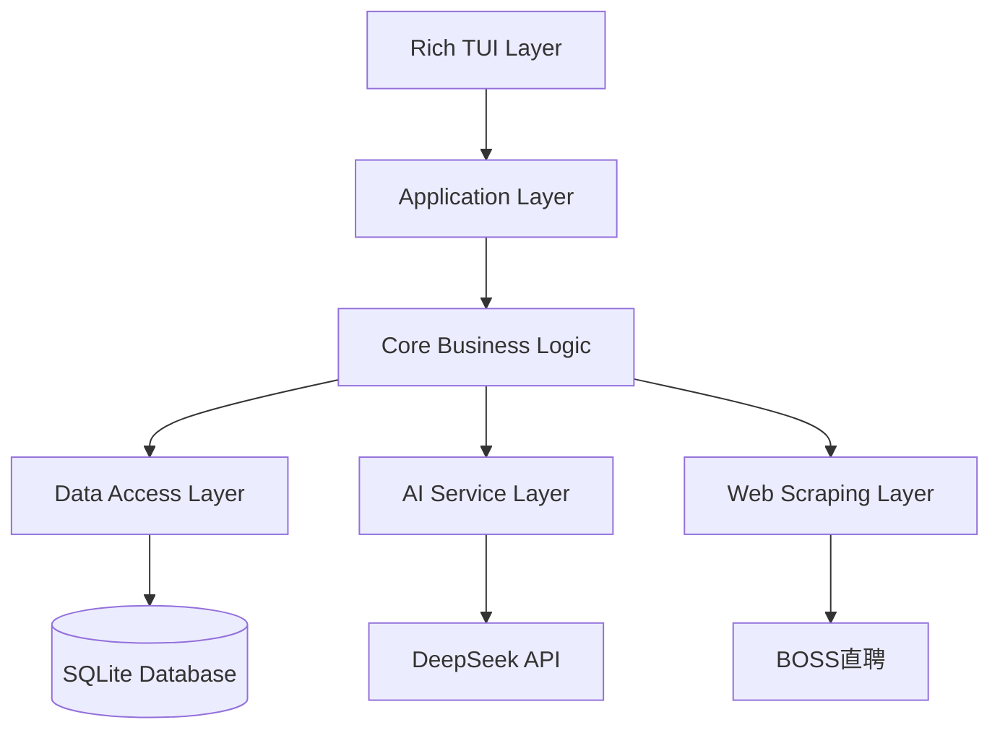
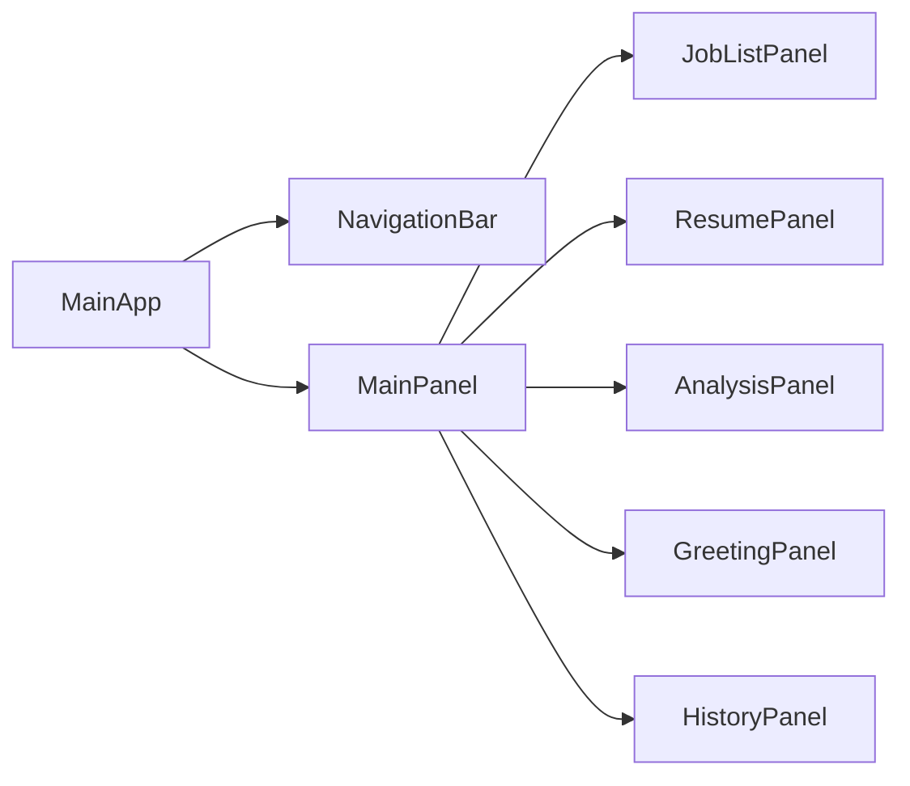
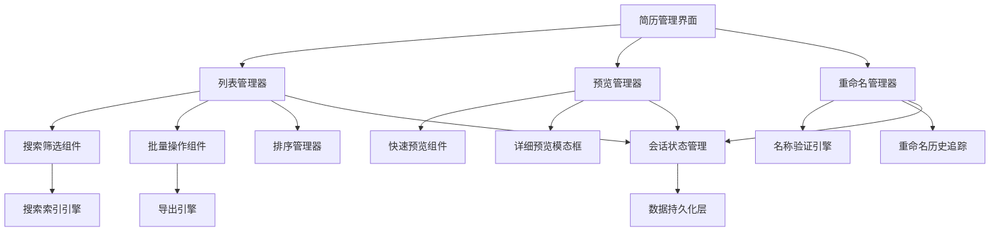

# Resume Assistant 设计文档

## 概述

Resume Assistant 是一个基于 Rich 框架的终端用户界面应用程序，旨在帮助求职者通过 AI 分析优化简历以匹配特定职位。系统采用模块化架构，集成 DeepSeek AI 模型，支持 BOSS 直聘职位信息爬取、简历解析、智能匹配分析、优化建议生成以及个性化打招呼语创建。

## 架构

### 整体架构



### 架构层次说明

1. **Rich TUI Layer**: 用户界面层，基于 Rich 框架实现终端图形界面
2. **Application Layer**: 应用控制层，协调各个组件和用户交互
3. **Core Business Logic**: 核心业务逻辑，包含简历分析、匹配算法等
4. **Data Access Layer**: 数据访问层，管理数据库操作和文件处理
5. **AI Service Layer**: AI 服务层，封装 DeepSeek API 调用
6. **Web Scraping Layer**: 网页抓取层，处理职位信息获取

### 技术栈选择

- **TUI 框架**: Rich - 提供丰富的终端UI组件和布局管理
- **数据库**: SQLite - 轻量级、无需配置的嵌入式数据库
- **PDF 解析**: PyMuPDF (fitz) - 高性能PDF文本提取
- **Markdown 解析**: python-markdown - 标准Markdown处理
- **网页爬虫**: requests + BeautifulSoup - 轻量级爬虫方案
- **AI 集成**: httpx - 现代异步HTTP客户端
- **配置管理**: pydantic-settings - 类型安全的配置管理
- **日志系统**: loguru - 现代化日志处理

## 组件和接口

### 1. TUI 组件架构



#### 1.1 主要 TUI 组件

**MainApp**
```python
class MainApp:
    """主应用程序类"""
    def __init__(self):
        self.console = Console()
        self.layout = self._create_layout()
        self.current_panel = "jobs"
        
    def _create_layout(self) -> Layout:
        """创建主布局"""
        pass
        
    def switch_panel(self, panel_name: str):
        """切换面板"""
        pass
```

**NavigationBar**
```python
class NavigationBar(Static):
    """导航栏组件"""
    BINDINGS = [
        ("1", "switch_jobs", "职位列表"),
        ("2", "switch_resume", "简历管理"),
        ("3", "switch_analysis", "分析结果"),
        ("4", "switch_greeting", "打招呼语"),
        ("5", "switch_history", "历史记录"),
    ]
```

**JobListPanel**
```python
class JobListPanel(Widget):
    """职位列表面板"""
    def __init__(self):
        super().__init__()
        self.table = DataTable()
        self.search_input = Input(placeholder="搜索职位...")
        
    def add_job(self, job: JobInfo):
        """添加职位到列表"""
        pass
        
    def filter_jobs(self, query: str):
        """筛选职位"""
        pass
```

### 2. 核心业务组件

#### 2.1 Job Scraper 组件

```python
class JobScraper:
    """职位信息爬虫"""
    
    def __init__(self, session: requests.Session):
        self.session = session
        self.headers = {
            'User-Agent': 'Mozilla/5.0 (Windows NT 10.0; Win64; x64) AppleWebKit/537.36'
        }
    
    async def scrape_job(self, url: str) -> JobInfo:
        """爬取单个职位信息"""
        pass
        
    def _parse_job_content(self, html: str) -> JobInfo:
        """解析职位HTML内容"""
        pass
```

#### 2.2 Resume Parser 组件

```python
class ResumeParser:
    """简历解析器"""
    
    def parse_pdf(self, file_path: Path) -> ResumeContent:
        """解析PDF简历"""
        pass
        
    def parse_markdown(self, file_path: Path) -> ResumeContent:
        """解析Markdown简历"""
        pass
        
    def _extract_sections(self, text: str) -> Dict[str, str]:
        """提取简历各部分内容"""
        pass
```

#### 2.3 AI Agent 组件架构

```python
from abc import ABC, abstractmethod
from typing import Dict, List, Optional
from enum import Enum

class AgentType(Enum):
    """Agent类型枚举"""
    GENERAL = "general"
    TECHNICAL = "technical"
    MANAGEMENT = "management"
    CREATIVE = "creative"
    SALES = "sales"
    CUSTOM = "custom"

@dataclass
class AIAgent:
    """AI Agent配置模型"""
    id: Optional[int] = None
    name: str = ""
    description: str = ""
    agent_type: AgentType = AgentType.GENERAL
    prompt_template: str = ""
    is_builtin: bool = False
    usage_count: int = 0
    average_rating: float = 0.0
    created_at: datetime = field(default_factory=datetime.now)
    updated_at: datetime = field(default_factory=datetime.now)

class LLMAgent(ABC):
    """LLM Agent 抽象基类"""
    
    def __init__(self, agent_config: AIAgent):
        self.config = agent_config
    
    @abstractmethod
    async def analyze_match(self, job: JobInfo, resume: ResumeContent) -> MatchAnalysis:
        """分析简历与职位匹配度"""
        pass
        
    @abstractmethod
    async def generate_optimization(self, analysis: MatchAnalysis) -> List[OptimizationSuggestion]:
        """生成优化建议"""
        pass
        
    @abstractmethod
    async def generate_greeting(self, job: JobInfo, resume: ResumeContent) -> List[GreetingMessage]:
        """生成打招呼语"""
        pass

class CustomizableAgent(LLMAgent):
    """可自定义的AI Agent实现"""
    
    def __init__(self, agent_config: AIAgent, api_key: str, base_url: str):
        super().__init__(agent_config)
        self.client = httpx.AsyncClient()
        self.api_key = api_key
        self.base_url = base_url
    
    async def analyze_match(self, job: JobInfo, resume: ResumeContent) -> MatchAnalysis:
        """使用自定义Prompt分析简历与职位匹配度"""
        formatted_prompt = self._format_prompt(
            self.config.prompt_template,
            job_description=job.description + "\n" + job.requirements,
            resume_content=resume.content,
            job_skills=", ".join(job.skills),
            resume_skills=", ".join(resume.skills)
        )
        
        # 调用DeepSeek API
        response = await self._call_deepseek_api(formatted_prompt)
        return self._parse_analysis_response(response, job.id, resume.id)
    
    def _format_prompt(self, template: str, **kwargs) -> str:
        """格式化Prompt模板"""
        return template.format(**kwargs)
    
    async def _call_deepseek_api(self, prompt: str) -> str:
        """调用DeepSeek API"""
        # API调用实现
        pass
    
    def _parse_analysis_response(self, response: str, job_id: int, resume_id: int) -> MatchAnalysis:
        """解析AI响应为分析结果"""
        # 响应解析实现
        pass

class AgentManager:
    """Agent管理器"""
    
    def __init__(self, db_manager: DatabaseManager):
        self.db_manager = db_manager
        self.builtin_agents = self._create_builtin_agents()
    
    def _create_builtin_agents(self) -> List[AIAgent]:
        """创建内置Agent配置"""
        return [
            AIAgent(
                id=1,
                name="通用分析Agent",
                description="适用于所有类型职位的通用分析",
                agent_type=AgentType.GENERAL,
                prompt_template="""
请分析以下简历与职位的匹配度：

职位描述：{job_description}
简历内容：{resume_content}

请从以下维度进行分析：
1. 技能匹配度 (0-100分)
2. 经验匹配度 (0-100分)  
3. 关键词覆盖率 (0-100分)
4. 总体匹配度 (0-100分)
5. 缺失的关键技能
6. 简历优势
7. 改进建议

请以JSON格式返回结果。
""",
                is_builtin=True
            ),
            AIAgent(
                id=2,
                name="技术岗位专用Agent",
                description="专门针对技术开发岗位的深度分析",
                agent_type=AgentType.TECHNICAL,
                prompt_template="""
作为技术招聘专家，请深度分析以下技术岗位简历匹配度：

职位技能要求：{job_skills}
职位描述：{job_description}
简历技能：{resume_skills}
简历内容：{resume_content}

重点分析：
1. 编程语言匹配度
2. 技术栈相关性
3. 项目经验技术含量
4. 技术深度评估
5. 学习能力体现
6. 具体的技术改进建议

请提供详细的技术评估和具体的技能提升建议。
""",
                is_builtin=True
            ),
            AIAgent(
                id=3,
                name="管理岗位专用Agent", 
                description="专门针对管理类岗位的领导力分析",
                agent_type=AgentType.MANAGEMENT,
                prompt_template="""
作为管理岗位招聘专家，请分析以下管理岗位简历匹配度：

职位描述：{job_description}
简历内容：{resume_content}

重点评估：
1. 领导力体现
2. 团队管理经验
3. 项目管理能力
4. 战略思维展现
5. 沟通协调能力
6. 业绩管理经验
7. 管理经验的提升建议

请从管理者角度提供专业评估和发展建议。
""",
                is_builtin=True
            ),
            AIAgent(
                id=4,
                name="创意行业专用Agent",
                description="专门针对创意设计类岗位的创新能力分析", 
                agent_type=AgentType.CREATIVE,
                prompt_template="""
作为创意行业招聘专家，请分析以下创意岗位简历匹配度：

职位描述：{job_description}
简历内容：{resume_content}

重点评估：
1. 创意思维体现
2. 设计能力展现
3. 作品集质量
4. 创新项目经验
5. 美学素养体现
6. 跨媒体技能
7. 创意能力提升建议

请从创意专业角度提供评估和作品优化建议。
""",
                is_builtin=True
            ),
            AIAgent(
                id=5,
                name="销售岗位专用Agent",
                description="专门针对销售类岗位的业绩和沟通能力分析",
                agent_type=AgentType.SALES,
                prompt_template="""
作为销售招聘专家，请分析以下销售岗位简历匹配度：

职位描述：{job_description}
简历内容：{resume_content}

重点评估：
1. 销售业绩数据
2. 客户关系管理能力
3. 沟通谈判技巧
4. 市场开拓经验
5. 目标达成能力
6. 抗压能力体现
7. 销售技能提升建议

请从销售专业角度提供评估和业绩优化建议。
""",
                is_builtin=True
            )
        ]
    
    async def create_custom_agent(self, agent_config: AIAgent) -> int:
        """创建自定义Agent"""
        # 验证Prompt模板
        if not self._validate_prompt_template(agent_config.prompt_template):
            raise ValueError("Invalid prompt template")
        
        agent_config.is_builtin = False
        return await self.db_manager.save_agent(agent_config)
    
    def _validate_prompt_template(self, template: str) -> bool:
        """验证Prompt模板的有效性"""
        required_placeholders = ["{job_description}", "{resume_content}"]
        return all(placeholder in template for placeholder in required_placeholders)
    
    async def get_all_agents(self) -> List[AIAgent]:
        """获取所有可用Agent（内置+自定义）"""
        custom_agents = await self.db_manager.get_all_agents()
        return self.builtin_agents + custom_agents
    
    async def get_agent_by_id(self, agent_id: int) -> Optional[AIAgent]:
        """根据ID获取Agent"""
        # 先查找内置Agent
        for agent in self.builtin_agents:
            if agent.id == agent_id:
                return agent
        
        # 再查找自定义Agent
        return await self.db_manager.get_agent(agent_id)
    
    async def update_agent_usage(self, agent_id: int, rating: float = None):
        """更新Agent使用统计"""
        await self.db_manager.update_agent_usage(agent_id, rating)
    
    async def delete_custom_agent(self, agent_id: int) -> bool:
        """删除自定义Agent"""
        agent = await self.get_agent_by_id(agent_id)
        if agent and not agent.is_builtin:
            return await self.db_manager.delete_agent(agent_id)
        return False

class AgentFactory:
    """Agent工厂类，用于创建不同的AI Agent实例"""
    
    def __init__(self, agent_manager: AgentManager):
        self.agent_manager = agent_manager
    
    async def create_agent_instance(self, agent_id: int, api_key: str, base_url: str) -> Optional[LLMAgent]:
        """根据Agent ID创建Agent实例"""
        agent_config = await self.agent_manager.get_agent_by_id(agent_id)
        if not agent_config:
            return None
        
        return CustomizableAgent(agent_config, api_key, base_url)
```

### 3. 数据访问组件

#### 3.1 Database Manager

```python
class DatabaseManager:
    """数据库管理器"""
    
    def __init__(self, db_path: Path):
        self.db_path = db_path
        self.init_database()
    
    def init_database(self):
        """初始化数据库表结构"""
        pass
        
    async def save_job(self, job: JobInfo) -> int:
        """保存职位信息"""
        pass
        
    async def save_resume(self, resume: ResumeContent) -> int:
        """保存简历信息"""
        pass
        
    async def save_analysis(self, analysis: MatchAnalysis) -> int:
        """保存分析结果"""
        pass
        
    async def save_greeting(self, greeting: GreetingMessage) -> int:
        """保存打招呼语"""
        pass
```

## 数据模型

### 1. 核心数据模型

```python
@dataclass
class JobInfo:
    """职位信息模型"""
    id: Optional[int] = None
    url: str = ""
    title: str = ""
    company: str = ""
    description: str = ""
    requirements: str = ""
    skills: List[str] = field(default_factory=list)
    created_at: datetime = field(default_factory=datetime.now)

@dataclass
class ResumeContent:
    """简历内容模型"""
    id: Optional[int] = None
    name: str = ""
    file_path: str = ""
    content: str = ""
    personal_info: Dict[str, str] = field(default_factory=dict)
    education: List[Dict[str, str]] = field(default_factory=list)
    experience: List[Dict[str, str]] = field(default_factory=list)
    projects: List[Dict[str, str]] = field(default_factory=list)
    skills: List[str] = field(default_factory=list)
    created_at: datetime = field(default_factory=datetime.now)

@dataclass
class MatchAnalysis:
    """匹配分析结果模型"""
    id: Optional[int] = None
    job_id: int = 0
    resume_id: int = 0
    overall_score: float = 0.0
    skill_match_score: float = 0.0
    experience_score: float = 0.0
    keyword_coverage: float = 0.0
    missing_skills: List[str] = field(default_factory=list)
    strengths: List[str] = field(default_factory=list)
    created_at: datetime = field(default_factory=datetime.now)

@dataclass
class OptimizationSuggestion:
    """优化建议模型"""
    section: str = ""
    original_text: str = ""
    suggested_text: str = ""
    reason: str = ""
    priority: int = 0

@dataclass
class GreetingMessage:
    """打招呼语模型"""
    id: Optional[int] = None
    job_id: int = 0
    resume_id: int = 0
    content: str = ""
    version: int = 1
    is_custom: bool = False
    created_at: datetime = field(default_factory=datetime.now)
```

### 2. 数据库表结构

```sql
-- 职位信息表
CREATE TABLE jobs (
    id INTEGER PRIMARY KEY AUTOINCREMENT,
    url TEXT UNIQUE NOT NULL,
    title TEXT NOT NULL,
    company TEXT NOT NULL,
    description TEXT,
    requirements TEXT,
    skills TEXT, -- JSON格式存储
    created_at TIMESTAMP DEFAULT CURRENT_TIMESTAMP,
    updated_at TIMESTAMP DEFAULT CURRENT_TIMESTAMP
);

-- 简历表
CREATE TABLE resumes (
    id INTEGER PRIMARY KEY AUTOINCREMENT,
    name TEXT NOT NULL,
    file_path TEXT,
    content TEXT NOT NULL,
    personal_info TEXT, -- JSON格式
    education TEXT, -- JSON格式
    experience TEXT, -- JSON格式
    projects TEXT, -- JSON格式
    skills TEXT, -- JSON格式
    is_default BOOLEAN DEFAULT FALSE,
    created_at TIMESTAMP DEFAULT CURRENT_TIMESTAMP,
    updated_at TIMESTAMP DEFAULT CURRENT_TIMESTAMP
);

-- 分析结果表
CREATE TABLE analyses (
    id INTEGER PRIMARY KEY AUTOINCREMENT,
    job_id INTEGER NOT NULL,
    resume_id INTEGER NOT NULL,
    agent_id INTEGER, -- 使用的Agent ID
    overall_score REAL,
    skill_match_score REAL,
    experience_score REAL,
    keyword_coverage REAL,
    missing_skills TEXT, -- JSON格式
    strengths TEXT, -- JSON格式
    suggestions TEXT, -- JSON格式存储优化建议
    raw_response TEXT, -- AI原始响应
    created_at TIMESTAMP DEFAULT CURRENT_TIMESTAMP,
    FOREIGN KEY (job_id) REFERENCES jobs (id),
    FOREIGN KEY (resume_id) REFERENCES resumes (id),
    FOREIGN KEY (agent_id) REFERENCES ai_agents (id)
);

-- 打招呼语表
CREATE TABLE greetings (
    id INTEGER PRIMARY KEY AUTOINCREMENT,
    job_id INTEGER NOT NULL,
    resume_id INTEGER NOT NULL,
    content TEXT NOT NULL,
    version INTEGER DEFAULT 1,
    is_custom BOOLEAN DEFAULT FALSE,
    created_at TIMESTAMP DEFAULT CURRENT_TIMESTAMP,
    FOREIGN KEY (job_id) REFERENCES jobs (id),
    FOREIGN KEY (resume_id) REFERENCES resumes (id)
);

-- AI Agent配置表
CREATE TABLE ai_agents (
    id INTEGER PRIMARY KEY AUTOINCREMENT,
    name TEXT NOT NULL,
    description TEXT,
    agent_type TEXT NOT NULL, -- general, technical, management, creative, sales, custom
    prompt_template TEXT NOT NULL,
    is_builtin BOOLEAN DEFAULT FALSE,
    usage_count INTEGER DEFAULT 0,
    average_rating REAL DEFAULT 0.0,
    created_at TIMESTAMP DEFAULT CURRENT_TIMESTAMP,
    updated_at TIMESTAMP DEFAULT CURRENT_TIMESTAMP
);

-- Agent使用历史表
CREATE TABLE agent_usage_history (
    id INTEGER PRIMARY KEY AUTOINCREMENT,
    agent_id INTEGER NOT NULL,
    analysis_id INTEGER NOT NULL,
    rating REAL, -- 用户评分 1-5
    feedback TEXT, -- 用户反馈
    created_at TIMESTAMP DEFAULT CURRENT_TIMESTAMP,
    FOREIGN KEY (agent_id) REFERENCES ai_agents (id),
    FOREIGN KEY (analysis_id) REFERENCES analyses (id)
);

-- 应用配置表
CREATE TABLE app_settings (
    key TEXT PRIMARY KEY,
    value TEXT NOT NULL,
    updated_at TIMESTAMP DEFAULT CURRENT_TIMESTAMP
);
```

## 错误处理

### 1. 错误分类和处理策略

```python
class ResumeAssistantError(Exception):
    """基础异常类"""
    pass

class NetworkError(ResumeAssistantError):
    """网络相关错误"""
    pass

class ParseError(ResumeAssistantError):
    """解析相关错误"""
    pass

class AIServiceError(ResumeAssistantError):
    """AI服务相关错误"""
    pass

class DatabaseError(ResumeAssistantError):
    """数据库相关错误"""
    pass
```

### 2. 错误处理机制

```python
class ErrorHandler:
    """统一错误处理器"""
    
    def __init__(self, console: Console):
        self.console = console
        self.logger = logger
    
    def handle_error(self, error: Exception, context: str = ""):
        """统一错误处理"""
        self.logger.error(f"Error in {context}: {str(error)}")
        
        if isinstance(error, NetworkError):
            self._show_network_error(error)
        elif isinstance(error, ParseError):
            self._show_parse_error(error)
        elif isinstance(error, AIServiceError):
            self._show_ai_error(error)
        else:
            self._show_general_error(error)
    
    def _show_network_error(self, error: NetworkError):
        """显示网络错误"""
        self.console.print(Panel(
            f"[red]网络连接失败[/red]\n{str(error)}\n\n请检查网络连接或稍后重试",
            title="网络错误"
        ))
```

### 3. 重试机制

```python
from tenacity import retry, stop_after_attempt, wait_exponential

class RetryableService:
    """支持重试的服务基类"""
    
    @retry(
        stop=stop_after_attempt(3),
        wait=wait_exponential(multiplier=1, min=4, max=10)
    )
    async def call_api(self, *args, **kwargs):
        """可重试的API调用"""
        pass
```

## 测试策略

### 1. 测试层次

```python
# 单元测试
class TestResumeParser(unittest.TestCase):
    def test_parse_pdf(self):
        """测试PDF解析功能"""
        pass
    
    def test_parse_markdown(self):
        """测试Markdown解析功能"""
        pass

# 集成测试
class TestAIIntegration(unittest.TestCase):
    def test_analysis_workflow(self):
        """测试完整分析流程"""
        pass

# UI测试
class TestTUIComponents(unittest.TestCase):
    def test_job_list_panel(self):
        """测试职位列表面板"""
        pass
```

### 2. Mock 策略

```python
# Mock AI服务
class MockAIAnalyzer(AIAnalyzer):
    async def analyze_match(self, job: JobInfo, resume: ResumeContent) -> MatchAnalysis:
        return MatchAnalysis(
            overall_score=0.85,
            skill_match_score=0.9,
            experience_score=0.8,
            keyword_coverage=0.75
        )

# Mock 网络服务
class MockJobScraper(JobScraper):
    async def scrape_job(self, url: str) -> JobInfo:
        return JobInfo(
            url=url,
            title="测试职位",
            company="测试公司",
            description="测试描述"
        )
```

### 3. 测试数据管理

```python
class TestDataManager:
    """测试数据管理器"""
    
    @staticmethod
    def create_sample_job() -> JobInfo:
        """创建示例职位数据"""
        return JobInfo(
            title="Python开发工程师",
            company="科技公司",
            description="负责后端开发工作",
            requirements="3年以上Python开发经验",
            skills=["Python", "Django", "MySQL"]
        )
    
    @staticmethod
    def create_sample_resume() -> ResumeContent:
        """创建示例简历数据"""
        return ResumeContent(
            name="张三简历",
            content="个人简历内容...",
            skills=["Python", "Java", "React"]
        )
```

## 性能优化

### 1. 异步处理

```python
class AsyncTaskManager:
    """异步任务管理器"""
    
    def __init__(self):
        self.task_queue = asyncio.Queue()
        self.workers = []
    
    async def start_workers(self, num_workers: int = 3):
        """启动工作协程"""
        for i in range(num_workers):
            worker = asyncio.create_task(self._worker(f"worker-{i}"))
            self.workers.append(worker)
    
    async def _worker(self, name: str):
        """工作协程"""
        while True:
            task = await self.task_queue.get()
            try:
                await task()
            except Exception as e:
                logger.error(f"Task failed in {name}: {e}")
            finally:
                self.task_queue.task_done()
```

### 2. 缓存策略

```python
from functools import lru_cache
import aiofiles

class CacheManager:
    """缓存管理器"""
    
    def __init__(self, cache_dir: Path):
        self.cache_dir = cache_dir
        self.cache_dir.mkdir(exist_ok=True)
    
    @lru_cache(maxsize=100)
    def get_analysis_cache(self, job_hash: str, resume_hash: str) -> Optional[MatchAnalysis]:
        """获取分析结果缓存"""
        pass
    
    async def save_analysis_cache(self, job_hash: str, resume_hash: str, analysis: MatchAnalysis):
        """保存分析结果到缓存"""
        pass
```

### 3. 数据库优化

```sql
-- 创建索引优化查询性能
CREATE INDEX idx_jobs_company ON jobs(company);
CREATE INDEX idx_jobs_created_at ON jobs(created_at);
CREATE INDEX idx_analyses_job_resume ON analyses(job_id, resume_id);
CREATE INDEX idx_analyses_agent_id ON analyses(agent_id);
CREATE INDEX idx_greetings_job_id ON greetings(job_id);
CREATE INDEX idx_agents_type ON ai_agents(agent_type);
CREATE INDEX idx_agents_builtin ON ai_agents(is_builtin);
CREATE INDEX idx_agent_usage_agent_id ON agent_usage_history(agent_id);

-- 创建视图简化复杂查询
CREATE VIEW job_analysis_summary AS
SELECT 
    j.title,
    j.company,
    a.overall_score,
    a.created_at as analysis_date
FROM jobs j
JOIN analyses a ON j.id = a.job_id
ORDER BY a.created_at DESC;
```

## 安全考虑

### 1. API 密钥管理

```python
from cryptography.fernet import Fernet
import os

class SecureConfig:
    """安全配置管理"""
    
    def __init__(self):
        self.encryption_key = self._get_or_create_key()
        self.cipher = Fernet(self.encryption_key)
    
    def _get_or_create_key(self) -> bytes:
        """获取或创建加密密钥"""
        key_file = Path.home() / ".resume_assistant" / "key"
        if key_file.exists():
            return key_file.read_bytes()
        else:
            key = Fernet.generate_key()
            key_file.parent.mkdir(exist_ok=True)
            key_file.write_bytes(key)
            return key
    
    def encrypt_api_key(self, api_key: str) -> str:
        """加密API密钥"""
        return self.cipher.encrypt(api_key.encode()).decode()
    
    def decrypt_api_key(self, encrypted_key: str) -> str:
        """解密API密钥"""
        return self.cipher.decrypt(encrypted_key.encode()).decode()
```

### 2. 数据加密

```python
class SecureStorage:
    """安全存储管理"""
    
    def __init__(self, encryption_key: bytes):
        self.cipher = Fernet(encryption_key)
    
    def encrypt_resume_content(self, content: str) -> str:
        """加密简历内容"""
        return self.cipher.encrypt(content.encode()).decode()
    
    def decrypt_resume_content(self, encrypted_content: str) -> str:
        """解密简历内容"""
        return self.cipher.decrypt(encrypted_content.encode()).decode()
```

### 3. 输入验证

```python
from pydantic import BaseModel, validator
import re

class JobUrlValidator(BaseModel):
    """职位URL验证器"""
    url: str
    
    @validator('url')
    def validate_boss_url(cls, v):
        """验证BOSS直聘URL格式"""
        pattern = r'https?://www\.zhipin\.com/job_detail/\w+\.html'
        if not re.match(pattern, v):
            raise ValueError('Invalid BOSS直聘 URL format')
        return v
```

## 部署和配置

### 1. 项目结构

```
resume_assistant/
├── src/
│   ├── resume_assistant/
│   │   ├── __init__.py
│   │   ├── main.py              # 应用入口
│   │   ├── config/
│   │   │   ├── __init__.py
│   │   │   └── settings.py      # 配置管理
│   │   ├── web/                 # Streamlit Web界面
│   │   │   ├── __init__.py
│   │   │   ├── app.py           # 主应用
│   │   │   ├── adapters.py      # Web适配器
│   │   │   ├── pages/           # 各页面组件
│   │   │   └── components/      # 通用UI组件
│   │   ├── core/
│   │   │   ├── __init__.py
│   │   │   ├── scraper.py       # 爬虫
│   │   │   ├── parser.py        # 解析器
│   │   │   ├── analyzer.py      # AI分析器
│   │   │   ├── agents.py        # AI Agent管理
│   │   │   └── generator.py     # 内容生成器
│   │   ├── data/
│   │   │   ├── __init__.py
│   │   │   ├── database.py      # 数据库管理
│   │   │   ├── models.py        # 数据模型
│   │   │   └── migrations/      # 数据库迁移
│   │   └── utils/
│   │       ├── __init__.py
│   │       ├── errors.py        # 错误定义
│   │       ├── logging.py       # 日志配置
│   │       └── security.py      # 安全工具
├── tests/
│   ├── unit/
│   ├── integration/
│   └── fixtures/
├── docs/
├── pyproject.toml
├── README.md
└── .env.example
```

### 2. 配置文件

```python
# settings.py
from pydantic_settings import BaseSettings
from pathlib import Path

class Settings(BaseSettings):
    """应用配置"""
    
    # AI服务配置
    deepseek_api_key: str = ""
    deepseek_base_url: str = "https://api.deepseek.com"
    
    # 数据库配置
    database_path: Path = Path.home() / ".resume_assistant" / "data.db"
    
    # 缓存配置
    cache_dir: Path = Path.home() / ".resume_assistant" / "cache"
    cache_ttl: int = 3600  # 1小时
    
    # 爬虫配置
    request_timeout: int = 30
    max_retries: int = 3
    
    # UI配置
    theme: str = "dark"
    auto_save: bool = True
    
    class Config:
        env_file = ".env"
        env_prefix = "RESUME_ASSISTANT_"
```

### 3. 依赖管理

```toml
# pyproject.toml
[build-system]
requires = ["poetry-core>=1.0.0"]
build-backend = "poetry.core.masonry.api"

[tool.poetry]
name = "resume-assistant"
version = "0.1.0"
description = "AI-powered resume optimization tool with TUI"
authors = ["Your Name <your.email@example.com>"]

[tool.poetry.dependencies]
python = "^3.9"
rich = "^13.0.0"
textual = "^0.40.0"
httpx = "^0.24.0"
requests = "^2.31.0"
beautifulsoup4 = "^4.12.0"
PyMuPDF = "^1.23.0"
python-markdown = "^3.5.0"
pydantic = "^2.0.0"
pydantic-settings = "^2.0.0"
loguru = "^0.7.0"
tenacity = "^8.2.0"
cryptography = "^41.0.0"
aiosqlite = "^0.19.0"

[tool.poetry.group.dev.dependencies]
pytest = "^7.4.0"
pytest-asyncio = "^0.21.0"
black = "^23.0.0"
isort = "^5.12.0"
mypy = "^1.5.0"
coverage = "^7.3.0"

[tool.poetry.scripts]
resume-assistant = "resume_assistant.main:main"
```

### 4. Web界面架构设计

基于需求文档的要求，本项目采用Streamlit作为Web界面框架，提供现代化的Web用户体验。

#### 4.1 Web界面组件结构

```python
# streamlit_app.py - 主应用入口
class ResumeAssistantApp:
    """Resume Assistant Streamlit Web应用"""
    
    def __init__(self):
        self.initialize_session_state()
        self.setup_page_config()
    
    def initialize_session_state(self):
        """初始化会话状态"""
        if 'current_page' not in st.session_state:
            st.session_state.current_page = 'jobs'
        if 'jobs' not in st.session_state:
            st.session_state.jobs = []
        if 'resumes' not in st.session_state:
            st.session_state.resumes = []
        if 'agents' not in st.session_state:
            st.session_state.agents = []
    
    def render(self):
        """渲染主界面"""
        # 侧边栏导航
        with st.sidebar:
            self.render_navigation()
        
        # 主内容区域
        self.render_main_content()
    
    def render_navigation(self):
        """渲染导航菜单"""
        st.title("Resume Assistant")
        
        pages = {
            'jobs': '📋 职位管理',
            'resumes': '📄 简历管理', 
            'agents': '🤖 AI Agent管理',
            'analysis': '📊 分析结果',
            'settings': '⚙️ 设置'
        }
        
        for page_key, page_name in pages.items():
            if st.button(page_name, key=f"nav_{page_key}"):
                st.session_state.current_page = page_key
                st.rerun()
    
    def render_main_content(self):
        """渲染主内容"""
        page = st.session_state.current_page
        
        if page == 'jobs':
            JobManagementPage().render()
        elif page == 'resumes':
            ResumeManagementPage().render()
        elif page == 'agents':
            AgentManagementPage().render()
        elif page == 'analysis':
            AnalysisResultsPage().render()
        elif page == 'settings':
            SettingsPage().render()
```

#### 4.2 页面组件设计

```python
# pages/agent_management.py
class AgentManagementPage:
    """AI Agent管理页面"""
    
    def render(self):
        st.title("🤖 AI Agent 管理")
        
        # Tab选项卡
        tab1, tab2, tab3 = st.tabs(["Agent列表", "创建Agent", "效果对比"])
        
        with tab1:
            self.render_agent_list()
        
        with tab2:
            self.render_create_agent()
        
        with tab3:
            self.render_agent_comparison()
    
    def render_agent_list(self):
        """渲染Agent列表"""
        st.subheader("可用的AI Agent")
        
        # 显示内置Agent
        st.write("**内置Agent**")
        builtin_agents = self.get_builtin_agents()
        for agent in builtin_agents:
            with st.expander(f"{agent.name} - {agent.description}"):
                col1, col2, col3 = st.columns([2, 1, 1])
                with col1:
                    st.write(f"类型：{agent.agent_type.value}")
                    st.write(f"使用次数：{agent.usage_count}")
                    st.write(f"平均评分：{agent.average_rating:.1f}/5.0")
                with col2:
                    if st.button(f"预览", key=f"preview_{agent.id}"):
                        st.code(agent.prompt_template, language="text")
                with col3:
                    if st.button(f"复制", key=f"copy_{agent.id}"):
                        st.session_state.template_to_copy = agent.prompt_template
        
        # 显示自定义Agent
        st.write("**自定义Agent**")
        custom_agents = self.get_custom_agents()
        for agent in custom_agents:
            with st.expander(f"{agent.name} - {agent.description}"):
                col1, col2, col3 = st.columns([2, 1, 1])
                with col1:
                    st.write(f"类型：{agent.agent_type.value}")
                    st.write(f"创建时间：{agent.created_at.strftime('%Y-%m-%d')}")
                    st.write(f"使用次数：{agent.usage_count}")
                with col2:
                    if st.button(f"编辑", key=f"edit_{agent.id}"):
                        st.session_state.editing_agent = agent.id
                with col3:
                    if st.button(f"删除", key=f"delete_{agent.id}"):
                        self.delete_agent(agent.id)
                        st.rerun()
    
    def render_create_agent(self):
        """渲染创建Agent界面"""
        st.subheader("创建自定义Agent")
        
        with st.form("create_agent_form"):
            name = st.text_input("Agent名称*", max_chars=50)
            description = st.text_area("Agent描述", max_chars=200)
            agent_type = st.selectbox(
                "分析类型",
                options=[t.value for t in AgentType if t != AgentType.GENERAL],
                format_func=lambda x: {
                    'technical': '技术类',
                    'management': '管理类', 
                    'creative': '创意类',
                    'sales': '销售类',
                    'custom': '自定义类'
                }.get(x, x)
            )
            
            # Prompt编辑器
            st.write("自定义Prompt模板*")
            if 'template_to_copy' in st.session_state:
                default_template = st.session_state.template_to_copy
                del st.session_state.template_to_copy
            else:
                default_template = self.get_default_template()
            
            prompt_template = st.text_area(
                "Prompt内容",
                value=default_template,
                height=300,
                max_chars=2000,
                help="必须包含 {job_description} 和 {resume_content} 占位符"
            )
            
            # 模板验证
            validation_result = self.validate_prompt_template(prompt_template)
            if validation_result['valid']:
                st.success("✅ Prompt模板格式正确")
            else:
                st.error(f"❌ {validation_result['error']}")
            
            # 提交按钮
            submitted = st.form_submit_button("创建Agent")
            
            if submitted and validation_result['valid'] and name:
                agent = AIAgent(
                    name=name,
                    description=description,
                    agent_type=AgentType(agent_type),
                    prompt_template=prompt_template,
                    is_builtin=False
                )
                if self.create_agent(agent):
                    st.success(f"Agent '{name}' 创建成功！")
                    st.rerun()
                else:
                    st.error("创建失败，请重试")
```

#### 4.3 Web适配器架构

```python
# web/adapters.py - Web界面适配器
class WebAgentManager:
    """Web界面Agent管理适配器"""
    
    def __init__(self, agent_manager: AgentManager):
        self.agent_manager = agent_manager
    
    async def get_available_agents(self) -> List[AIAgent]:
        """获取所有可用Agent"""
        return await self.agent_manager.get_all_agents()
    
    async def create_custom_agent(self, agent_data: dict) -> bool:
        """创建自定义Agent"""
        try:
            agent = AIAgent(**agent_data)
            await self.agent_manager.create_custom_agent(agent)
            return True
        except Exception as e:
            st.error(f"创建Agent失败：{str(e)}")
            return False
    
    def validate_agent_prompt(self, prompt: str) -> dict:
        """验证Agent Prompt模板"""
        required_placeholders = ['{job_description}', '{resume_content}']
        missing = [p for p in required_placeholders if p not in prompt]
        
        if missing:
            return {
                'valid': False,
                'error': f"缺少必要占位符: {', '.join(missing)}"
            }
        
        if len(prompt.strip()) < 50:
            return {
                'valid': False,
                'error': "Prompt内容太短，至少需要50个字符"
            }
        
        return {'valid': True, 'error': None}
    
    async def compare_agents(self, job_id: int, resume_id: int, agent_ids: List[int]) -> dict:
        """对比多个Agent的分析结果"""
        results = {}
        
        for agent_id in agent_ids:
            agent = await self.agent_manager.get_agent_by_id(agent_id)
            if agent:
                # 执行分析
                analysis = await self.analyze_with_agent(job_id, resume_id, agent_id)
                results[agent.name] = {
                    'agent': agent,
                    'analysis': analysis
                }
        
        return results
```

## 简历管理功能增强设计

### 5. 简历管理架构改进

基于需求文档中新增的简历管理功能需求，需要对现有的简历管理架构进行增强设计。

#### 5.1 增强的简历管理组件架构



#### 5.2 数据流设计

**简历列表显示流程:**
1. 用户访问简历管理页面
2. 系统从数据库加载简历列表
3. 应用搜索筛选条件
4. 按指定方式排序
5. 渲染增强的列表界面
6. 显示统计信息和批量操作工具

**简历预览功能流程:**
1. 用户点击预览按钮
2. 系统加载完整简历数据
3. 解析结构化信息（技能、经验等）
4. 渲染预览界面（快速预览或详细模态框）
5. 提供快捷操作入口（重命名、删除、分析）

**简历重命名功能流程:**
1. 用户触发重命名操作
2. 切换到编辑模式
3. 实时输入验证
4. 用户确认或取消
5. 更新数据库和会话状态
6. 记录重命名历史
7. 刷新界面显示

#### 5.3 组件间接口设计

**搜索筛选接口:**
- 输入: 搜索查询字符串、筛选条件、排序方式
- 输出: 过滤后的简历列表
- 支持的搜索字段: 文件名、个人姓名、技能关键词、文件内容

**预览功能接口:**
- 输入: 简历ID或简历对象
- 输出: 结构化的预览数据
- 支持模式: 快速预览（卡片内嵌入）、详细预览（模态对话框）

**重命名功能接口:**
- 输入: 简历ID、新名称
- 验证规则: 非空、长度限制、特殊字符检查、重名检查
- 输出: 操作结果状态和错误信息

#### 5.4 状态管理设计

**会话状态结构:**
```
session_state:
  ├── resumes: List[Dict]              # 简历列表数据
  ├── search_query: str                # 当前搜索查询
  ├── file_type_filter: str            # 文件类型筛选
  ├── sort_by: str                     # 排序方式
  ├── selected_resumes: List[int]      # 选中的简历ID列表
  ├── preview_resume: Dict             # 当前预览的简历
  ├── show_preview_modal: bool         # 是否显示预览模态框
  ├── editing_states: Dict[int, bool]  # 各简历的编辑状态
  └── batch_operation_mode: bool       # 批量操作模式
```

**数据同步策略:**
- 简历列表数据从数据库异步加载到会话状态
- 用户操作立即更新会话状态，然后异步同步到数据库
- 重要操作（重命名、删除）采用乐观锁机制
- 批量操作采用事务处理确保数据一致性

#### 5.5 数据模型扩展设计

**原有简历模型扩展:**
- 添加显示名称字段（display_name）用于重命名功能
- 添加文件元数据字段（file_size, upload_time, last_modified）
- 添加解析状态字段（parse_status, parse_errors）
- 添加用户偏好字段（is_favorite, tags）

**新增重命名历史模型:**
- 记录每次重命名操作的历史
- 支持重命名操作的审计和回滚

#### 5.6 性能优化设计

**列表渲染优化:**
- 采用虚拟滚动技术处理大量简历
- 实现简历卡片的懒加载
- 缓存搜索结果避免重复计算

**搜索功能优化:**
- 建立简历内容的全文搜索索引
- 实现搜索建议和自动补全
- 支持高级搜索语法

**预览功能优化:**
- 简历内容的分块加载
- 预览数据的客户端缓存
- 图片和附件的延迟加载

#### 5.7 用户体验设计原则

**响应式交互:**
- 所有操作提供即时视觉反馈
- 长时间操作显示进度指示器
- 错误状态有明确的错误提示和恢复建议

**一致性设计:**
- 统一的图标语言和交互模式
- 一致的颜色系统和排版规范
- 标准化的操作确认和取消流程

**可访问性考虑:**
- 支持键盘导航
- 适当的对比度和字体大小
- 屏幕阅读器友好的语义化标记

#### 5.8 错误处理和容错设计

**重命名操作容错:**
- 前端实时验证防止无效输入
- 后端验证确保数据完整性
- 并发冲突检测和解决机制

**批量操作容错:**
- 部分失败时的回滚策略
- 操作进度的实时反馈
- 失败项目的详细错误报告

**数据恢复机制:**
- 简历删除的软删除机制（回收站）
- 重要操作的操作日志记录
- 数据备份和恢复策略

这个设计文档从架构层面描述了简历管理功能的增强设计，重点关注组件关系、数据流、接口设计和系统架构，为后续的实现提供了清晰的技术指导。